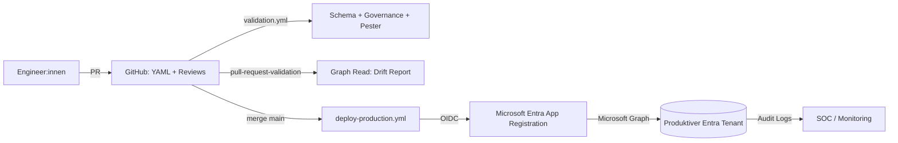
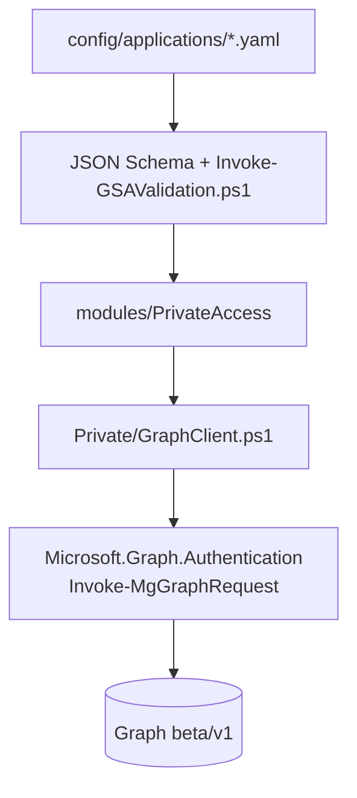
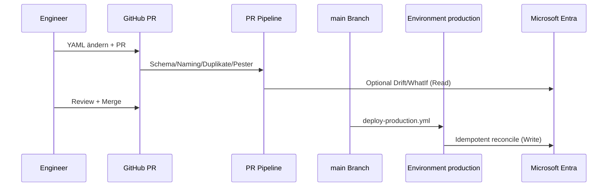

# Microsoft Entra Private Access – Enterprise GitOps

Dieses Repository ist die **Single Source of Truth** für **Microsoft Entra Private Access** (Global Secure Access / Zero Trust Network Access) Anwendungen in **einem** produktiven Microsoft Entra Mandanten. Es kombiniert **deklarative YAML-Konfiguration**, **PowerShell 7 Automatisierung** über **Microsoft Graph** und **GitHub Actions** mit **OIDC**, um Änderungen **governed**, **auditierbar** und **idempotent** auszurollen.

> Graph-Hinweis: Die Automatisierung folgt dem offiziellen Microsoft Learn Tutorial inklusive `beta` Endpunkten für Segmente und Connector Groups. Referenz: [Configure Microsoft Entra Private Access using Microsoft Graph APIs](https://learn.microsoft.com/en-us/graph/tutorial-entra-private-access)

---

## Inhaltsverzeichnis

1. [Warum dieses Repository existiert](#warum-dieses-repository-existiert)
2. [Architektur (Zielbild)](#architektur-zielbild)
3. [End-to-End Deployment Flow](#end-to-end-deployment-flow)
4. [Repository-Struktur](#repository-struktur)
5. [YAML Desired State (`gsa.gitops/v1`)](#yaml-desired-state-gsagitopsv1)
6. [PowerShell Module](#powershell-module)
7. [GitHub Actions & OIDC](#github-actions--oidc)
8. [Validierung, WhatIf und Drift](#validierung-whatif-und-drift)
9. [Genehmigungen & Branch Protection](#genehmigungen--branch-protection)
10. [Rollback & Emergency](#rollback--emergency)
11. [Sicherheit & Least Privilege](#sicherheit--least-privilege)
12. [Observability](#observability)
13. [Lokale Entwicklung](#lokale-entwicklung)
14. [Weiterführende Dokumentation](#weiterführende-dokumentation)

---

## Warum dieses Repository existiert

In großen Organisationen skaliert Private Access nicht über „ClickOps“, sondern über:

- **Git als System of Record** (Reviews, Blame, Tags, Releases)
- **Automatisierte Gates** vor jeder Mutation im Mandanten
- **klare Ownership** pro Anwendung (`metadata.owners`)
- **Nachvollziehbarkeit** über Tickets (`metadata.changeReference`) und Pipeline-Artefakte

Dieses Repository ist bewusst **ohne** künstliche Dev/Test/Prod-Mandanten im Git modelliert. Stattdessen gibt es **einen** produktiven Zielmandanten und **mehrstufige Sicherheit** (Validierung, WhatIf/Drift, Reviews, Environment Protection).

---

## Architektur (Zielbild)



### Schichtenmodul



Details: `docs/architecture/overview.md`

---

## End-to-End Deployment Flow



---

## Repository-Struktur

Die vollständige Erklärung aller Ordner finden Sie in `docs/repository-structure.md` (Tabelle inkl. Zweck von `modules`, `scripts`, `schemas`, `tests`, `docs`, `build`, `.github`).

---

## YAML Desired State (`gsa.gitops/v1`)

Jede Datei unter `config/applications/` beschreibt **genau eine** Anwendung.

Kernelemente:

- `metadata.name` – entspricht dem `displayName` der erzeugten App (eindeutig).
- `metadata.owners` – Verantwortliche (E-Mail).
- `metadata.changeReference` – externes Ticket / RFC / CHG.
- `metadata.graphApplicationId` – optional, für Importe und stabile Bindung.
- `spec.applicationType` – `enterprise` (nonwebapp) oder `quickAccess` (quickaccessapp).
- `spec.connectorGroup` – **Name** der Application Proxy Connector Group (wird per Graph aufgelöst).
- `spec.destinations` – Liste aus Zielen mit `host`, `type`, `ports`, `protocol`.
- `spec.assignments` – `principalId` (empfohlen) oder `principalName` (nur User/Group, Auflösung zur Laufzeit).

Beispiele: `config/applications/contoso-hr-portal.example.yaml`, `config/applications/contoso-fileserver.example.yaml`.

JSON Schema: `schemas/private-access-application.schema.json`

---

## PowerShell Module

### `modules/Common`

Strukturierte Logs (`Write-GSAStructuredLog`), Korrelation (`New-GSACorrelationId`), Retry (`Invoke-GSARetryableOperation`).

### `modules/PrivateAccess`

Öffentliche Cmdlets (Auswahl):

| Cmdlet | Zweck |
| --- | --- |
| `Connect-GSAEnvironment` | Graph Session (Azure CLI Token nach OIDC, interaktiv, optional AccessToken) |
| `Get-GSAPrivateAccessApplication` | Lookup per `graphApplicationId` oder `displayName` |
| `New-GSAPrivateAccessApplication` | Erstellt App via Template + Segmente + Zuweisungen |
| `Set-GSAPrivateAccessApplication` | Idempotentes Update (optional entfernen abwesender Segmente/Zuweisungen) |
| `Remove-GSAPrivateAccessApplication` | Löscht Application (Break-Glass) |
| `Compare-GSAState` | Drift zwischen YAML und Mandant |
| `Test-GSAConfiguration` | Schema-Check einer Datei |
| `Invoke-GSADeployment` | Ordner-basiertes Deployment mit `-DryRun` / `-WhatIf` |

> **Microsoft Entra PowerShell** kann ergänzend für Directory-Szenarien genutzt werden; die Kernpfade sind absichtlich **Microsoft Graph**-basiert, um API-Stabilität und Portabilität zu maximieren.

---

## GitHub Actions & OIDC

| Workflow | Trigger | Zweck |
| --- | --- | --- |
| `validation.yml` | `workflow_call`, `workflow_dispatch` | PSScriptAnalyzer, YAML/Schema, Pester, Artefakte |
| `pull-request-validation.yml` | PR zu `main` | Ruft `validation.yml` auf + optional Drift/WhatIf + PR-Kommentar |
| `deploy-production.yml` | Push `main` (Pfade gefiltert) | Produktives Reconcile nach Environment-Genehmigung |

### Konfiguration: Microsoft Entra (Kurzüberblick)

Voraussetzung **vor** den GitHub-Schritten:

1. App Registration (z. B. `sp-gsa-gitops-prod`) im Zielmandanten.
2. **Federated Credentials** (GitHub Actions) – Subjects müssen zu den Workflows passen (siehe Tabelle unten).
3. **Microsoft Graph → Application permissions** (nicht Delegated): `Application.ReadWrite.All`, `AppRoleAssignment.ReadWrite.All`, optional `Directory.Read.All` (oder `User.Read.All` + `Group.Read.All` bei `principalName` in YAML).
4. **Grant admin consent** im Mandanten.

| Workflow im Repo | Empfohlener Entity type in Entra | Subject (Beispiel) |
| --- | --- | --- |
| `deploy-production.yml` | **Environment** → `production` | `repo:<org>/<repo>:environment:production` |
| `pull-request-validation.yml` (WhatIf) | **Pull request** | `repo:<org>/<repo>:pull_request` |

Details zu Graph Permissions: `docs/security/authentication-and-permissions.md`

### Konfiguration in GitHub (Schritt für Schritt)

Nach Abschluss der App Registration in Entra konfigurieren Sie **nur Repository-Variablen und ein Environment** – **kein** `AZURE_CLIENT_SECRET`.

#### Schritt 1: Repository-Variablen

Pfad: Repository → **Settings** → **Secrets and variables** → **Actions** → Tab **Variables** → **New repository variable**

| Variable | Wert | Quelle (Entra Portal) |
| --- | --- | --- |
| `AZURE_TENANT_ID` | Directory (Tenant) ID | App Registration → **Overview** → **Directory (tenant) ID** |
| `GSA_GRAPH_CLIENT_ID` | Application (client) ID | App Registration → **Overview** → **Application (client) ID** |

Die Namen müssen **exakt** so heißen (Workflows verwenden `vars.AZURE_TENANT_ID` und `vars.GSA_GRAPH_CLIENT_ID`).

#### Schritt 2: Environment `production`

Pfad: **Settings** → **Environments** → **New environment** → Name: **`production`**

Empfohlen:

- **Required reviewers** – mindestens eine Person für Produktions-Deploys.
- Optional: **Deployment branches** → nur **`main`**.

Entspricht `environment: production` in `.github/workflows/deploy-production.yml` und der Federated Credential mit Entity type **Environment**.

#### Schritt 3: Actions aktivieren

**Settings** → **Actions** → **General**: Actions für das Repository erlauben.

Die Workflows setzen `permissions: id-token: write` bereits in den YAML-Dateien (Voraussetzung für OIDC) – keine zusätzliche manuelle Konfiguration nötig.

#### Schritt 4: Ersten Lauf testen

1. **Ohne Entra:** **Actions** → Workflow **validation** → **Run workflow** (Branch `main`) – prüft Schema/Pester.
2. **Mit Entra (PR):** Branch + PR mit Änderung unter `config/applications/` → Jobs `call-validation` und optional `what-if-comment` (benötigt Federated Credential **Pull request**).
3. **Mit Entra (Deploy):** Merge nach `main` → Workflow **deploy-production** → unter **Actions** beim Run **Review deployments** / **Approve** für Environment `production`.

#### Schritt 5: Erfolg prüfen

| Symptom | Typische Ursache |
| --- | --- |
| Azure Login / OIDC fehlgeschlagen | Federated Credential Subject passt nicht (Environment `production` / Pull request) |
| Variable nicht gesetzt | `AZURE_TENANT_ID` oder `GSA_GRAPH_CLIENT_ID` fehlt oder falsch geschrieben |
| Graph 403 nach Login | Admin consent für Application permissions fehlt |
| Connector Group nicht gefunden | `spec.connectorGroup` in YAML ≠ Name in Entra (Gruppe manuell anlegen) |

#### Was Sie in GitHub **nicht** anlegen müssen

- Kein `AZURE_CLIENT_SECRET`
- Kein `AZURE_SUBSCRIPTION_ID` (`allow-no-subscriptions: true` in den Workflows)
- Kein separates Graph-Secret – Token über OIDC und `az account get-access-token --resource-type ms-graph`

Vollständige Security-Anleitung (Entra + GitHub + Fehlerbilder): `docs/security/authentication-and-permissions.md`

---

## Validierung, WhatIf und Drift

- **PR Phase (ohne Writes)**: `scripts/validate/Invoke-GSAValidation.ps1` prüft Schema, Naming (`PA-...`), Duplikate auf Ziel-Signatur-Ebene und Assignment-Plausibilität.
- **WhatIf / Drift**: `scripts/utils/Export-GSAWhatIfReport.ps1` erzeugt JSON mit `Compare-GSAState` Ergebnissen (Graph Reads).
- **Merge / Prod**: `scripts/deploy/Invoke-ProductionDeployment.ps1` führt `Invoke-GSADeployment` aus.

---

## Genehmigungen & Branch Protection

Empfohlene Kombination:

- Branch Protection auf `main` (PR required, Status Checks required)
- `CODEOWNERS` für `config/applications/**`
- GitHub Environment `production` als operative Freigabe **zusätzlich** zum Code Review

Governance-Modell: `docs/governance/model.md`

---

## Rollback & Emergency

- **Standard**: Git Revert + erneutes Deployment (Git bleibt Source of Truth).
- **Emergency**: siehe `docs/operations/runbook.md` (Break-Glass, Drift-Bereinigung).

---

## Sicherheit & Least Privilege

- Keine Secrets im Repository.
- OIDC statt Client Secrets.
- App Permissions minimal halten (siehe Tabelle in `docs/security/authentication-and-permissions.md`).

---

## Observability

- JSON Logs mit `correlationId` pro Lauf.
- GitHub Step Summary in `Invoke-ProductionDeployment.ps1` (Tabelle pro Datei).
- Konzept für Log Analytics / Sentinel: `docs/architecture/overview.md` und `docs/operations/runbook.md`.

---

## Lokale Entwicklung

```powershell
git clone <repo>
cd entra-private-access-gitops
pwsh ./build/Invoke-LocalCI.ps1
```

Das Skript installiert u. a. `powershell-yaml`, `Pester`, `PSScriptAnalyzer`, `Microsoft.Graph.Authentication` in den CurrentUser-Scope.

---

## Weiterführende Dokumentation

| Thema | Datei |
| --- | --- |
| Ordner & Zweck | `docs/repository-structure.md` |
| Architektur | `docs/architecture/overview.md` |
| Governance | `docs/governance/model.md` |
| Security / Graph Permissions | `docs/security/authentication-and-permissions.md` |
| Onboarding | `docs/onboarding/engineer-guide.md` |
| Troubleshooting | `docs/troubleshooting/common-issues.md` |
| Betrieb / Runbooks | `docs/operations/runbook.md` |
| FAQ | `docs/FAQ.md` |
| Roadmap | `docs/roadmap.md` |
| Beispiel-Change | `docs/examples/sample-change.md` |

---

## Support-Hinweis

Dieses Repository ist als **Unternehmens-Blueprint** gedacht: Organisationsspezifische Teams, Variablen und Policies müssen Sie in GitHub und Entra einmalig konfigurieren (`CODEOWNERS`, Branch Protection, Federated Credentials).
