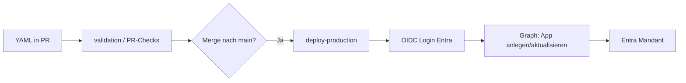
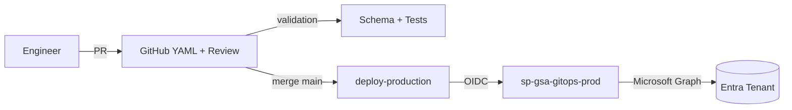

# Microsoft Entra Private Access – Enterprise GitOps

Dieses Repository ist die **Single Source of Truth** für **Microsoft Entra Private Access** (Global Secure Access / ZTNA) in **einem** produktiven Microsoft-Entra-Mandanten. Sie beschreiben Zugriffsregeln in **YAML-Dateien**; **GitHub Actions** wenden sie automatisch per **Microsoft Graph** im Mandanten an.

> **Graph:** Die Automatisierung folgt dem [Microsoft Learn Tutorial – Private Access per Graph](https://learn.microsoft.com/en-us/graph/tutorial-entra-private-access) (inkl. `beta`-Endpunkte für Segmente und Connector Groups).

---

## Inhaltsverzeichnis

1. [Kurz erklärt: Was Sie als Engineer tun](#kurz-erklärt-was-sie-als-engineer-tun)
2. [Git in 2 Minuten (ohne Vorkenntnisse)](#git-in-2-minuten-ohne-vorkenntnisse)
3. [Neue Private-Access-Regel anlegen – Schritt für Schritt](#neue-private-access-regel-anlegen--schritt-für-schritt)
4. [Was passiert automatisch in der Pipeline?](#was-passiert-automatisch-in-der-pipeline)
5. [Was die Pipeline technisch in Entra macht](#was-die-pipeline-technisch-in-entra-macht)
6. [Voraussetzungen im Mandanten (vor dem ersten Deploy)](#voraussetzungen-im-mandanten-vor-dem-ersten-deploy)
7. [Nach dem Deploy: Portal & Clients (Pflicht für Nutzer)](#nach-dem-deploy-portal--clients-pflicht-für-nutzer)
8. [Berechtigungen der Pipeline (wichtige Erkenntnisse)](#berechtigungen-der-pipeline-wichtige-erkenntnisse)
9. [Deploy erneut testen / Fehler beheben](#deploy-erneut-testen--fehler-beheben)
10. [YAML-Referenz (`gsa.gitops/v1`)](#yaml-referenz-gsagitopsv1)
11. [Architektur & Repository](#architektur--repository)
12. [Einmalige Einrichtung (Plattform-Team)](#einmalige-einrichtung-plattform-team)
13. [Weiterführende Dokumentation](#weiterführende-dokumentation)

---

## Kurz erklärt: Was Sie als Engineer tun

| Sie müssen **nicht** | Sie müssen **nur** |
| --- | --- |
| Im Entra-Portal klicken, um Apps anzulegen | Eine **YAML-Datei** unter `config/applications/` anlegen oder ändern |
| Git auf der Kommandozeile beherrschen | Einen **Pull Request** in GitHub erstellen und mergen lassen (geht auch **nur im Browser**) |
| Die Pipeline manuell starten (nach Merge) | PR-Checks abwarten; nach Merge ggf. **Production** in Actions **freigeben** |

**Ablauf in einem Satz:** YAML beschreibt die gewünschte Private-Access-App → Review im PR → Merge nach `main` → Pipeline legt oder aktualisiert die App im Mandanten.

**Wichtig:** Dateien mit Endung **`.example.yaml`** sind **nur Vorlagen** – sie werden **nicht** deployed. Produktive Dateien heißen z. B. `pa-mein-team-rdp-server01.yaml` (ohne `.example`).

---

## Git in 2 Minuten (ohne Vorkenntnisse)

| Begriff | Bedeutung für Sie |
| --- | --- |
| **Repository (Repo)** | Dieses Projekt auf GitHub – enthält alle YAML-Regeln und Automatisierung |
| **Branch** | Eine Arbeitskopie Ihrer Änderungen, z. B. `feature/pa-neues-rdp` – **nicht** sofort produktiv |
| **Pull Request (PR)** | Antrag: „Bitte meine Änderungen in den offiziellen Stand (`main`) übernehmen“ |
| **Merge** | PR wird angenommen → Ihre YAML landet auf Branch **`main`** → **Deploy-Pipeline** kann starten |
| **`main`** | Der genehmigte Produktionsstand – nur hieraus wird in den Entra-Mandanten geschrieben |

Sie arbeiten fast immer so: **neuer Branch → Datei ändern → PR → Review → Merge**. Sie müssen keine `git`-Befehle kennen, wenn Sie alles über die **GitHub-Weboberfläche** machen (siehe nächstes Kapitel).

---

## Neue Private-Access-Regel anlegen – Schritt für Schritt

### Was Sie vorher klären sollten

| Thema | Beispiel | Wer legt es an? |
| --- | --- | --- |
| **Connector Group** (Name exakt) | `Office-Gersthofen` | Meist Netzwerk/Plattform im Portal |
| **Ziel** (IP, FQDN, Ports) | `10.0.1.1`, TCP `3389` | Sie in YAML |
| **Berechtigte Gruppe** | `SEC-GSA-PA-OFFICE-RDP-GERSTHOFEN` | Identity-Team in Entra |
| **Ticket / Change** | `CHG-12345` | Sie in `metadata.changeReference` |
| **Eindeutiger App-Name** | `PA-NUVATECH-OFFICE-RDP-GERSTHOFEN` | Sie in `metadata.name` (Konvention `PA-…`) |

Ohne existierende **Connector Group** und **Sicherheitsgruppe** schlägt der Deploy später fehl (nach dem App-Anlegen).

---

### Schritt 1: Vorlage kopieren (GitHub im Browser)

1. Öffnen Sie das Repository auf GitHub.
2. Gehen Sie zu **`config/applications/`**.
3. Öffnen Sie z. B. `contoso-hr-portal.example.yaml` (oder eine andere `*.example.yaml`).
4. Klicken Sie **⋯** → **Open file** → oben rechts **⋯** → **Copy raw file** / oder: **Add file** → **Create new file**.
5. Dateiname (produktiv, **ohne** `.example`):

   `pa-nuvatech-office-rdp-gersthofen.yaml`

   (Kleinbuchstaben und Bindestriche sind üblich; der **Anzeigename** in Entra kommt aus `metadata.name`.)

6. Inhalt anpassen – **Minimalbeispiel RDP** (aus dem produktiven Muster im Repo):

```yaml
apiVersion: gsa.gitops/v1
kind: PrivateAccessApplication
metadata:
  name: PA-NUVATECH-OFFICE-RDP-GERSTHOFEN
  description: RDP-Zugriff Office Gersthofen (TCP/3389) über Connector Group Office-Gersthofen.
  owners:
    - ihre.email@nuvatech.com
  changeReference: CHG-12345-001
  tags:
    site: gersthofen
    protocol: rdp
spec:
  applicationType: enterprise
  isAccessibleViaZTNAClient: true
  connectorGroup: Office-Gersthofen
  destinations:
    - host: "10.0.1.1"
      type: ipAddress
      ports: ["3389"]
      protocol: tcp
  assignments:
    - principalType: Group
      principalName: SEC-GSA-PA-OFFICE-RDP-GERSTHOFEN
```

**Tipps:**

- `metadata.name` = exakter **Display Name** der App in Entra (eindeutig, Großbuchstaben mit `PA-` empfohlen).
- `connectorGroup` muss **zeichengenau** dem Namen in Entra entsprechen.
- `principalId` (GUID) ist **stabiler** als `principalName` – wenn Sie die Gruppen-ID haben, nutzen Sie:

```yaml
  assignments:
    - principalType: Group
      principalId: "aaaaaaaa-bbbb-cccc-dddd-eeeeeeeeeeee"
```

7. Unten: **Commit changes…** → Commit auf einem **neuen Branch** (GitHub schlägt z. B. `feature/pa-office-rdp` vor) → **Propose changes** / **Create pull request**.

---

### Schritt 2: Pull Request – automatische Prüfung

Nach dem Öffnen des PR laufen **ohne Ihr Zutun** u. a.:

| Check | Was wird geprüft? |
| --- | --- |
| **validation** | YAML-Syntax, JSON-Schema, Namenskonvention `PA-…`, keine Duplikate |
| **pull-request-validation** | Wie oben + optional **WhatIf/Drift** (liest Mandant, **schreibt nicht**) |

- **Grün** = aus Repository-Sicht in Ordnung.
- **Rot** = Fehlermeldung im Job-Log lesen (oft Tippfehler in `connectorGroup`, Schema, Name).

Reviewer (laut `CODEOWNERS`) geben den PR frei.

---

### Schritt 3: Merge → automatischer Produktions-Deploy

1. PR **Merge** nach `main` (Button in GitHub).
2. Unter **Actions** erscheint Workflow **`deploy-production`** (Start durch Push auf `main`, nur wenn sich u. a. `config/applications/**` geändert hat).
3. Falls **Environment `production`** mit **Required reviewers** konfiguriert ist:
   - Run öffnen → **Review deployments** → **Approve and deploy**.
4. Job **Deploy** führt `Invoke-ProductionDeployment.ps1` aus → für jede YAML (ohne `*.example.yaml`) wird der Mandant **angepasst**.

**Erfolg prüfen:**

- Actions: Workflow **grün**, Log z. B. `Verarbeite pa-nuvatech-office-rdp-gersthofen.yaml` **ohne** `403 Forbidden`.
- Entra → **Enterprise applications** → App `PA-NUVATECH-OFFICE-RDP-GERSTHOFEN` mit Private-Access-Segment und Zuweisung.

Optional danach (Plattform): `metadata.graphApplicationId` in der YAML setzen (Object-ID der App aus Entra) – stabilisiert spätere Updates. Die Pipeline funktioniert auch ohne (Lookup per `displayName`).

---

### Alternative: Änderung mit Git auf dem Laptop

```bash
git clone https://github.com/Nuvatech-GmbH/entra-private-access-gitops.git
cd entra-private-access-gitops
git checkout -b feature/pa-meine-neue-app
cp config/applications/contoso-hr-portal.example.yaml config/applications/pa-meine-neue-app.yaml
# Datei bearbeiten
pwsh ./scripts/validate/Invoke-GSAValidation.ps1   # optional, lokal
git add config/applications/pa-meine-neue-app.yaml
git commit -m "feat: Private Access für Mein-System"
git push -u origin feature/pa-meine-neue-app
```

Danach in GitHub den PR öffnen (Link erscheint oft in der Terminal-Ausgabe).

---

### Bestehende Regel ändern

1. Datei unter `config/applications/<ihre-datei>.yaml` bearbeiten (PR wie oben).
2. Nach Merge: Pipeline **aktualisiert** die bestehende App (Segmente, Zuweisungen, Connector Group).
3. Ports oder Zuweisungen ändern = höheres Risiko → Security-Review einplanen.

---

## Was passiert automatisch in der Pipeline?



| Phase | Workflow | Schreibt in Entra? |
| --- | --- | --- |
| PR | `pull-request-validation.yml` | **Nein** (Validierung; WhatIf nur Lesen) |
| Nach Merge | `deploy-production.yml` | **Ja** (Produktion) |

**Manueller Deploy-Start** ist normalerweise **nicht** nötig. Ausnahmen:

- **Erneut testen** ohne neuen Commit: **Actions** → **deploy-production** → letzten Run → **Re-run all jobs**.
- Neuer Commit auf `main` (auch leerer Commit), der Pfade unter `config/applications/**` berührt, startet den Workflow ebenfalls.

`deploy-production` hat **keinen** „Run workflow“-Knopf (kein `workflow_dispatch`) – dafür **Re-run** oder Push auf `main`.

---

## Was die Pipeline technisch in Entra macht

Für **jede** produktive YAML-Datei (kein `*.example.yaml`):

| Schritt | Graph (vereinfacht) | Bedeutung |
| --- | --- | --- |
| 1 | App existiert? (Name oder `graphApplicationId`) | Entscheidung Create vs. Update |
| 2 | `POST …/applicationTemplates/…/instantiate` | Neue **Enterprise Application** aus Microsoft-Template |
| 3 | `PATCH …/applications/{id}` mit `onPremisesPublishing` | Typ `enterprise` / `quickAccess`, **ZTNA-Client** (`isAccessibleViaZTNAClient`) |
| 4 | `PUT …/applications/{id}/connectorGroup/$ref` | Verbindung zur **Connector Group** |
| 5 | `POST …/applicationSegments` | **Ziele** (IP/FQDN, Ports, Protokoll) |
| 6 | `POST …/servicePrincipals/…/appRoleAssignments` | **Zuweisung** an User/Gruppe |

Bei **Update** werden fehlende Segmente/Zuweisungen ergänzt; optionale Flags können entfernte Einträge auch löschen (`-RemoveAbsentSegments` / `-RemoveAbsentAssignments` – Standard-Deploy nutzt konservative Defaults).

---

## Voraussetzungen im Mandanten (vor dem ersten Deploy)

**Einmalig durch Plattform / Identity** (nicht durch jede YAML-Änderung):

| Komponente | Beschreibung |
| --- | --- |
| App Registration `sp-gsa-gitops-prod` | Pipeline-Identität, OIDC zu GitHub |
| Graph **Application permissions** + Admin Consent | `Application.ReadWrite.All`, **`OnPremisesPublishingProfiles.ReadWrite.All`**, `AppRoleAssignment.ReadWrite.All`, `Directory.Read.All` |
| **Directory-Rollen** am **Service Principal** der Pipeline | Empfohlen: **Application Administrator** (zusätzlich zu Graph Permissions) |
| GitHub Variables | `AZURE_TENANT_ID`, `GSA_GRAPH_CLIENT_ID` |
| Environment **`production`** | Optional: Freigabe vor Deploy |
| Federated Credentials | Subject für `environment:production` und `pull_request` |
| Connector + **Connector Group** | Pro Standort/Netz, Name wie in YAML |
| Entra ID / GSA-Lizenzen | Private Access im Tenant freigeschaltet |

---

## Nach dem Deploy: Portal & Clients (Pflicht für Nutzer)

Die Pipeline legt die **Enterprise Application**, **Segmente**, **Connector-Group-Zuordnung** und die **Zuweisung an die Gruppe** (`spec.assignments`) an. Damit Endnutzer **tatsächlich** per Private Access zugreifen können, fehlen im Regelfall noch **mandantenweite** Schritte im Portal – die **nicht** aus der YAML kommen.

| Schritt | Wo (Entra Admin Center) | Kurz |
| --- | --- | --- |
| **1** | Global Secure Access → Connectors | Connector Group + **aktiver** Connector (meist schon durch Netzwerk) |
| **2** | Global Secure Access → Verbinden → **Datenverkehrsweiterleitung** | **Profil für privaten Zugriff** auf **Aktiviert** (oft initial **Deaktiviert**) |
| **3** | Dieselbe Seite → Zuweisungen am Profil | Dieselbe **Gruppe** wie in YAML (z. B. `SEC-GSA-PA-…`) – **nicht** „0 Benutzer, 0 Gruppen“ |
| **4** | Test-Client | **Global Secure Access Client** installieren, wenn `isAccessibleViaZTNAClient: true` |

**Wichtig:** Die Gruppe in `spec.assignments` (GitOps → **Unternehmensanwendung**) und die Gruppe am **Datenverkehrsprofil** sind **zwei getrennte Zuweisungen** – beide werden benötigt.

**Ausführlich** (Checklisten, Symptome, Screenshots-Pfade, Lab-Test):  
→ [`docs/operations/portal-configuration-after-deploy.md`](docs/operations/portal-configuration-after-deploy.md)

---

## Berechtigungen der Pipeline (wichtige Erkenntnisse)

### Pflicht: `OnPremisesPublishingProfiles.ReadWrite.All` (Application permission)

Für **Private Access** per **OIDC / App-only** reicht `Application.ReadWrite.All` **nicht** für `PATCH` auf `onPremisesPublishing`.

| Permission | Zweck |
| --- | --- |
| `Application.ReadWrite.All` | App aus Template anlegen (`instantiate`) |
| **`OnPremisesPublishingProfiles.ReadWrite.All`** | **`onPremisesPublishing` / ZTNA setzen** (ohne angemeldeten Benutzer) |

Entra → App registrations → `sp-gsa-gitops-prod` → **API permissions** → Microsoft Graph → **Application permissions** → `OnPremisesPublishingProfiles.ReadWrite.All` → **Grant admin consent**.

Referenz: [Graph permissions – OnPremisesPublishingProfiles.ReadWrite.All](https://learn.microsoft.com/en-us/graph/permissions-reference#onpremisespublishingprofilesreadwriteall)

### Zusätzlich empfohlen: Directory-Rollen am Pipeline-Service-Principal

| Rolle | Zweck |
| --- | --- |
| **Application Administrator** | Ergänzend zu Graph Permissions |
| **Global Secure Access Administrator** | GSA-Einstellungen |

**Zuweisung:** Entra → **Roles and administrators** → Rolle wählen → **Add assignment** → Mitglied = **Service principal** → `sp-gsa-gitops-prod` (Enterprise App).

**Häufiger Fehler:** Rolle nur der App Registration oder einem User zugewiesen, nicht dem **Service Principal**.

Nach Rollenänderung: **10–15 Minuten** warten, halbfertige Apps aus **Enterprise applications** löschen, Pipeline **Re-run**.

### Least Privilege – realistische Einordnung

- Die **spezifische** Application permission `OnPremisesPublishingProfiles.ReadWrite.All` ist schmaler als `Directory.ReadWrite.All` und der übliche Fix für App-Proxy/Private-Access-Automation.
- Directory-Rollen am Service Principal bleiben **empfohlen**, ersetzen aber **nicht** die Graph Application permission oben.

Details: `docs/security/authentication-and-permissions.md`

---

## Deploy erneut testen / Fehler beheben

| Situation | Vorgehen |
| --- | --- |
| Deploy nach Rollen-Fix | Halbfertige App im Portal löschen → **Actions** → **deploy-production** → **Re-run all jobs** |
| Nach fehlgeschlagenem Lauf | App `PA-…` in **Enterprise applications** entfernen, sonst „kaputte“ Teilkonfiguration |
| Graph **403** auf `PATCH …/applications/…` | **`OnPremisesPublishingProfiles.ReadWrite.All`** + Admin Consent; ggf. Application Administrator am SP |
| Connector Group nicht gefunden | Name in YAML = Name in Entra; Gruppe manuell angelegt? |
| Gruppe für Zuweisung | `principalName` muss existieren oder `principalId` nutzen |
| Deploy grün, Zugriff geht nicht | Datenverkehrsprofil **Privater Zugriff** aktivieren + Gruppe am Profil; GSA Client → [`portal-configuration-after-deploy.md`](docs/operations/portal-configuration-after-deploy.md) |
| Segment-Duplikat (`Invalid_AppSegments_NonwebApp_Duplicate`) | Andere App im Tenant mit gleicher IP+Port löschen → `docs/troubleshooting/common-issues.md` |
| OIDC / Login failed | Federated Credential Subject = `repo:…:environment:production` |
| Variables | `AZURE_TENANT_ID`, `GSA_GRAPH_CLIENT_ID` exakt in GitHub |

Mehr: `docs/troubleshooting/common-issues.md`

---

## YAML-Referenz (`gsa.gitops/v1`)

Jede produktive Datei: `config/applications/<name>.yaml` ( **nicht** `*.example.yaml` ).

| Feld | Pflicht | Beschreibung |
| --- | --- | --- |
| `metadata.name` | Ja | Eindeutiger App-Name in Entra (`PA-TEAM-SYSTEM`) |
| `metadata.owners` | Ja | E-Mail-Verantwortliche |
| `metadata.changeReference` | Ja | Ticket / CHG / RFC |
| `metadata.graphApplicationId` | Nein | GUID für stabile Bindung nach erstem Deploy |
| `spec.applicationType` | Ja | `enterprise` oder `quickAccess` |
| `spec.isAccessibleViaZTNAClient` | Ja | `true` für Private Access über GSA-Client |
| `spec.connectorGroup` | Ja | **Name** der Connector Group im Mandanten |
| `spec.destinations[]` | Ja | `host`, `type` (`ipAddress`, `fqdn`, …), `ports`, `protocol` |
| `spec.assignments[]` | Ja | `principalType` + `principalId` oder `principalName` |

**Beispiel-Vorlagen (werden nicht deployed):**

- `config/applications/contoso-hr-portal.example.yaml`
- `config/applications/contoso-fileserver.example.yaml`

**Produktives Beispiel im Repo:** `config/applications/pa-nuvatech-office-rdp-gersthofen.yaml`

JSON Schema: `schemas/private-access-application.schema.json`

---

## Architektur & Repository



| Workflow | Trigger | Zweck |
| --- | --- | --- |
| `validation.yml` | Manuell / `workflow_call` | PSScriptAnalyzer, Schema, Pester |
| `pull-request-validation.yml` | PR → `main` | Validierung + optional WhatIf |
| `deploy-production.yml` | Push `main` (gefilterte Pfade) | Produktives Reconcile |

**Ordner (Auswahl):**

| Pfad | Inhalt |
| --- | --- |
| `config/applications/` | Ihre gewünschten Private-Access-Apps (YAML) |
| `modules/PrivateAccess/` | PowerShell → Graph |
| `scripts/deploy/` | Produktions-Deploy-Skript |
| `scripts/validate/` | PR-Validierung |
| `.github/workflows/` | Pipeline-Definitionen |

Ausführlich: `docs/repository-structure.md`, `docs/architecture/overview.md`

**PowerShell (lokal testen ohne Entra-Schreiben):**

```powershell
git clone https://github.com/Nuvatech-GmbH/entra-private-access-gitops.git
cd entra-private-access-gitops
pwsh ./build/Invoke-LocalCI.ps1
```

---

## Einmalige Einrichtung (Plattform-Team)

Kurzcheckliste – Details in `docs/security/authentication-and-permissions.md`:

1. App Registration `sp-gsa-gitops-prod` im Zielmandanten.
2. Federated Credentials: **Environment** `production` + **Pull request**.
3. Graph **Application permissions** + **Grant admin consent**.
4. Directory-Rollen am **Service Principal**: mindestens **Application Administrator** (+ empfohlen **Global Secure Access Administrator**).
5. GitHub Variables: `AZURE_TENANT_ID`, `GSA_GRAPH_CLIENT_ID`.
6. GitHub Environment **`production`** (optional Required reviewers, Branch `main`).
7. Branch Protection + `CODEOWNERS` für `config/applications/**`.

**Nicht nötig:** `AZURE_CLIENT_SECRET`, Azure Subscription für dieses Repo.

---

## Weiterführende Dokumentation

| Thema | Datei |
| --- | --- |
| Security / OIDC / Rollen | `docs/security/authentication-and-permissions.md` |
| Troubleshooting (403, Connector, …) | `docs/troubleshooting/common-issues.md` |
| **Portal nach Deploy (Profil, Client, Checkliste)** | **`docs/operations/portal-configuration-after-deploy.md`** |
| Onboarding Engineers | `docs/onboarding/engineer-guide.md` |
| Governance | `docs/governance/model.md` |
| Runbook / Rollback | `docs/operations/runbook.md` |
| Beispiel-Change | `docs/examples/sample-change.md` |
| FAQ | `docs/FAQ.md` |

---

## Support-Hinweis

Dieses Repository ist ein **Unternehmens-Blueprint**: `CODEOWNERS`, Branch Protection, Federated Credentials und Entra-Rollen müssen einmalig zur Organisation passen konfiguriert werden. Für fachliche Änderungen an Zugriffsregeln reicht in der Regel der Weg **YAML → PR → Merge** – ohne tiefes Git- oder Portal-Know-how.
