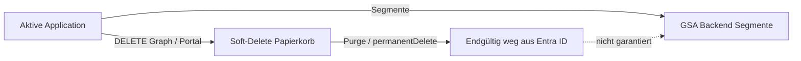

# Application Lifecycle: Löschen, Papierkorb und Purge

## Entscheidung (verbindlich für dieses Repository)

| Frage | Entscheidung |
| --- | --- |
| War **Purge unter „Gelöschte Anwendungen“** der richtige Weg? | **Ja** – für Test-/Konflikt-Bereinigung und verwaiste Private-Access-Apps. |
| Soll **`deploy-production`** gelöschte Apps automatisch aus dem Papierkorb purgen? | **Nein** – bewusst **nicht** in der Standard-Pipeline. |
| Soll die Pipeline bei jedem Deploy alle `deletedItems` durchsuchen und löschen? | **Nein** – zu weitreichend, irreversibel, nicht GitOps-Desired-State. |
| Wann ist Purge per Graph sinnvoll? | **Nur manuell**, gezielt pro `appId`/`objectId` nach dokumentiertem Runbook (Konflikt, Test-Aufräumen). |

**Kurz:** Soft-Delete ist Entras **Wiederherstellungsfenster**. Purge ist **endgültig**. Das gehört in **operative Break-Glass-/Cleanup-Schritte**, nicht in den täglichen Reconcile-Deploy.

---

## Hintergrund: Drei Ebenen beim „Löschen“



| Ebene | Wo sichtbar | Was es bedeutet |
| --- | --- | --- |
| **1. Enterprise Application / App-Registrierung (aktiv)** | Unternehmensanwendungen, App-Registrierungen | Normale App |
| **2. Soft-Delete (Papierkorb)** | App-Registrierungen → **Gelöschte Anwendungen** | App kann noch wiederhergestellt werden (begrenzte Zeit) |
| **3. GSA Application Segments** | Oft **nur** per Graph / GSA-PowerShell | Kann **ohne** sichtbare App weiter existieren → Segment-Duplikat-Fehler |

**Wichtig:** Schritt 2 (Purge) **hilft oft**, löst aber **nicht garantiert** Schritt 3 (verwaiste GSA-Segmente). Nach Purge können Segmente trotzdem noch blockieren → Diagnose-Skript / Segment-Löschung / Support (siehe `docs/troubleshooting/common-issues.md`).

---

## Warum kein automatischer Purge in der Pipeline?

1. **Irreversibel** – falsche `appId` = Datenverlust ohne Rollback.
2. **Nicht Desired-State** – GitOps beschreibt, **was existieren soll** (`config/applications/*.yaml`), nicht „alles im Papierkorb leeren“.
3. **Mandantenweite Wirkung** – `deletedItems` kann Apps anderer Teams betreffen, die bewusst im Papierkorb liegen.
4. **Berechtigungen** – Permanent Delete ist höher privilegiert; Pipeline soll Least Privilege bleiben.
5. **Unzuverlässig für das eigentliche Problem** – Segment-Konflikte entstehen im **GSA-Backend**; Purge allein reicht manchmal nicht.

Die Pipeline **`deploy-production`** macht daher:

- ✅ App aus YAML **anlegen / aktualisieren**
- ❌ **kein** automatisches Purge von `directory/deletedItems`
- ❌ **kein** „Cleanup aller PA-Test-Apps“

---

## Empfohlener Betriebsablauf

### A) Fehlgeschlagener Deploy / Segment-Konflikt (Ihr Fall)

1. `conflictingApplication` aus Pipeline-Log notieren (`objectId`, `appId`).
2. Aktive Rest-Apps des fehlgeschlagenen Laufs löschen (Enterprise Applications).
3. **App-Registrierungen → Gelöschte Anwendungen** → betroffene Einträge → **Endgültig löschen** (Purge) — **das haben Sie richtig gemacht**.
4. Optional: `scripts/admin/Invoke-GSASegmentConflictDiagnostics.ps1` (Segmente prüfen/löschen).
5. Erneut deployen.

### B) Bewusste Entfernung einer Private-Access-App aus dem Betrieb

1. YAML-Datei aus `config/applications/` entfernen (separater PR, Review).
2. *Optional später:* explizites `Remove-GSAPrivateAccessApplication` (nicht Standard-Deploy).
3. Purge **nur** wenn fachlich gewünscht und dokumentiert (kein Wiederherstellungsbedarf).

### C) Wiederherstellung statt Purge

Wenn die App nur versehentlich gelöscht wurde: **Papierkorb → Wiederherstellen**, **nicht** purgen.

---

## Purge per Graph (manuell, gezielt)

Nach Soft-Delete liegt die Application unter:

`GET https://graph.microsoft.com/v1.0/directory/deletedItems/microsoft.graph.application`

**Endgültig löschen (ein Objekt):**

```http
DELETE https://graph.microsoft.com/v1.0/directory/deletedItems/{objectId}
```

PowerShell (interaktiv, **nicht** Pipeline):

```powershell
Connect-MgGraph -Scopes 'Application.ReadWrite.All','Directory.ReadWrite.All'

# objectId aus Fehlermeldung oder Papierkorb
$objectId = 'f8473034-5426-4d77-912c-7c323b8ec6dd'
Invoke-MgGraphRequest -Method DELETE -Uri "https://graph.microsoft.com/v1.0/directory/deletedItems/$objectId"
```

Im Modul (explizit, mit WhatIf):

```powershell
Remove-GSAPrivateAccessApplication -ApplicationId $objectId -PurgeFromRecycleBin
# oder nur Purge, wenn die App bereits soft-deleted ist:
Remove-GSAPrivateAccessApplication -ApplicationId $objectId -PurgeFromRecycleBin -RecycleBinOnly
```

---

## Prävention (Team-Regeln)

| Regel | Begründung |
| --- | --- |
| Private-Access-Apps **primär über GitOps** oder GSA → Enterprise applications verwalten | Weniger Drift zwischen Entra-UI und GSA-Backend |
| Test-Apps mit Präfix `PA-` und Ticket in `changeReference` | Aufräumen auffindbar |
| Nach Test: **Papierkorb prüfen** und bekannte Test-`appId`s purgen | Verhindert `Invalid_AppSegments_NonwebApp_Duplicate` |
| Kein manuelles Anlegen/Löschen nur unter „Entra Enterprise Applications“ ohne GSA-Blade | Reduziert verwaiste Segmente |

---

## Verwandte Artefakte

| Artefakt | Zweck |
| --- | --- |
| `docs/troubleshooting/common-issues.md` | Segment-Duplikat, verwaiste Segmente |
| `scripts/admin/Invoke-GSASegmentConflictDiagnostics.ps1` | Konflikt-App/Segmente finden |
| `modules/PrivateAccess/Public/Remove-GSAPrivateAccessApplication.ps1` | Explizites Löschen (+ optional `-PurgeFromRecycleBin`) |
| `docs/operations/runbook.md` | Rollback, kein Auto-Purge |

---

## Änderungshistorie

| Datum | Beschreibung |
| --- | --- |
| 2026-05-19 | Entscheidung: kein Auto-Purge in Pipeline; Purge manuell im Papierkorb; Doku ergänzt |
