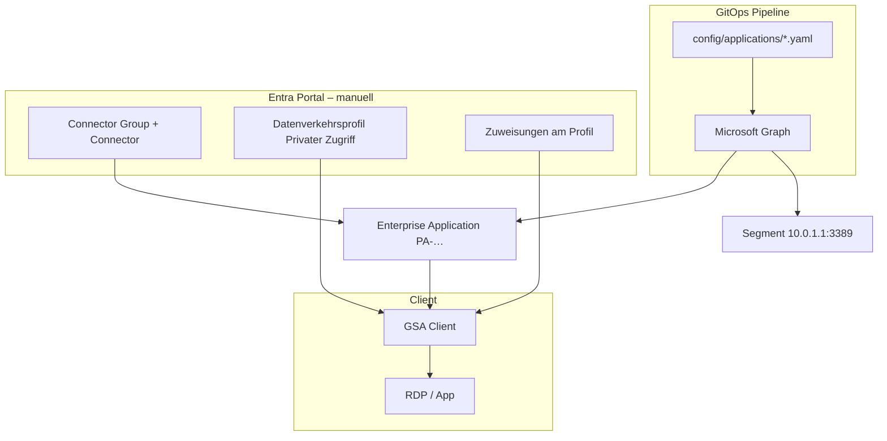

# Portal-Konfiguration nach dem GitOps-Deploy (Private Access)

Dieses Dokument beschreibt **alles, was im Microsoft-Entra-Mandanten manuell bzw. durch Plattform/Identity konfiguriert werden muss**, damit Private Access **für Endnutzer funktioniert** – **zusätzlich** zu dem, was die GitHub-Pipeline aus `config/applications/*.yaml` per Microsoft Graph anlegt.

> **Kurz:** Connector + YAML + grüner Pipeline-Lauf reichen **nicht** aus. Mindestens das **Datenverkehrsprofil für privaten Zugriff** muss aktiviert und **Benutzer/Gruppen** diesem Profil zugewiesen werden. Auf den Clients wird in der Regel der **Global Secure Access Client** benötigt.

Referenz (Microsoft): [Configure Microsoft Entra Private Access using Microsoft Graph APIs](https://learn.microsoft.com/en-us/graph/tutorial-entra-private-access)

---

## Zwei Ebenen: Was GitOps macht vs. was das Portal macht

| Ebene | Wer | Wo | Was |
| --- | --- | --- | --- |
| **Anwendungsdefinition** | GitOps-Pipeline (`sp-gsa-gitops-prod`) | Graph API | Enterprise-App, `onPremisesPublishing`, Connector-Group-Zuordnung, **Application Segments**, **App-Zuweisung** (Gruppe/User am Service Principal) |
| **Mandantenweite GSA-Verbindung** | Plattform / Identity / Netzwerk | Entra Admin Center → **Global Secure Access** | Connector Groups, **Datenverkehrsweiterleitung**, Profil-Zuweisungen, ggf. Bedingter Zugriff |
| **Client** | Endpoint / Workplace | Windows/macOS/iOS | **Microsoft Entra Global Secure Access Client** (wenn `isAccessibleViaZTNAClient: true`) |



**Häufiger Irrtum:** Die Gruppe `SEC-GSA-PA-OFFICE-RDP-GERSTHOFEN` in der YAML wird von der Pipeline an die **Enterprise Application** gebunden (`appRoleAssignments`). Das ist **nicht** dieselbe Zuweisung wie „Benutzer/Gruppen“ am **Datenverkehrsprofil für privaten Zugriff**. **Beides** ist nötig.

---

## Voraussetzungen (einmalig im Mandanten)

| Voraussetzung | Prüfung | Verantwortlich |
| --- | --- | --- |
| **Microsoft Entra Suite** (Private Access / GSA) lizenziert | Entra → Lizenzen / GSA-Features verfügbar | Plattform |
| **Global Secure Access Administrator** (oder vergleichbare Rolle) für Portal-Konfiguration | Person kann GSA-Blade öffnen und Profile ändern | Identity |
| **Connector Group** existiert (Name = `spec.connectorGroup` in YAML) | GSA → Connectors → Connector Groups | Netzwerk |
| **Mindestens ein aktiver Connector** in der Gruppe | Status „Aktiv“ / healthy, erreichbar aus dem Office-Netz | Netzwerk |
| **Sicherheitsgruppe** für Zuweisungen existiert | Entra ID → Gruppen, z. B. `SEC-GSA-PA-…` | Identity |
| **Pipeline-Deploy erfolgreich** | GitHub Actions `deploy-production` grün | GitOps |

---

## Schritt-für-Schritt im Entra Admin Center

Navigation (deutsche UI, kann leicht abweichen):

**Start** → **Microsoft Entra** → **Global Secure Access** (oder **Globaler sicherer Zugriff**)

### 1. Connector Group und Connector (meist schon erledigt)

**Pfad:** Global Secure Access → **Connectors** → **Connector groups**

| Prüfpunkt | Erwartung |
| --- | --- |
| Connector Group Name | Exakt wie in YAML, z. B. `Office-Gersthofen` |
| Connector installiert | Auf einem Server/VM im Office-Netz (nah am Zielnetz) |
| Status | **Aktiv** (nicht nur installiert, sondern verbunden) |
| Netzwerk | Ausgehend HTTPS zu Microsoft; keine Blockade der GSA-Connector-Endpunkte |

Ohne aktiven Connector erreicht kein Tunnel das Netz `10.0.1.x` – unabhängig von korrekter YAML.

**Troubleshooting:** Connector offline → Firewall/Proxy, Dienst auf dem Connector-Host, Neuinstallation laut [Microsoft-Doku Application Proxy Connector](https://learn.microsoft.com/en-us/entra/identity/app-proxy/application-proxy-add-on-premises-application).

---

### 2. Datenverkehrsprofil „Privater Zugriff“ aktivieren (Pflicht)

**Pfad:** Global Secure Access → **Verbinden** → **Datenverkehrsweiterleitung**

Karte: **Profil für privaten Zugriff** (Private Access profile)

| Einstellung | Zielwert | Hinweis |
| --- | --- | --- |
| **Status** | **Aktiviert** | Im Standard steht oft **Deaktiviert** – dann wird **kein** privater Datenverkehr über GSA geleitet |
| **Zuletzt geändert** | aktuelles Datum | Nach dem Aktivieren |

**Was passiert technisch:** Das Profil steuert, ob Clients im Tenant privaten Datenverkehr (u. a. zu Ihren Private-Access-Apps) über den Global Secure Access-Dienst aufbauen. Ohne Aktivierung bleibt die Enterprise-App im Portal zwar sichtbar, Endnutzer bekommen aber keinen funktionierenden ZTNA-Pfad.

Dieses Repo **ändert dieses Profil nicht** per Graph (bewusst außerhalb des App-YAML-Scopes).

---

### 3. Benutzer und Gruppen am Profil zuweisen (Pflicht)

Auf derselben Seite (**Datenverkehrsweiterleitung** → Profil für privaten Zugriff) → Bereich **Zuweisungen** (Assignments):

| Feld im Portal | Typischer Wert |
| --- | --- |
| Benutzer / Gruppen | Dieselbe Gruppe wie in YAML, z. B. `SEC-GSA-PA-OFFICE-RDP-GERSTHOFEN` |
| Anzeige vorher | **0 Benutzer, 0 Gruppen zugewiesen** = noch niemand nutzt Private Access |

**Empfehlung:** Gruppen statt Einzeluser (Least Privilege, einfacheres Onboarding).

**Unterschied zur Pipeline-Zuweisung:**

| Zuweisung | Bedeutung |
| --- | --- |
| **Am Service Principal der App** (GitOps, `spec.assignments`) | Wer die **App** in Entra „sehen/darf“ (App-Rolle **User**) |
| **Am Datenverkehrsprofil** (Portal) | Wer **privaten Datenverkehr** über GSA überhaupt bekommt |

Für einen RDP-Test müssen Testuser **Mitglied der Gruppe** sein **und** die Gruppe am **Profil** hängen.

---

### 4. Enterprise Application prüfen (nach grünem Deploy)

**Pfad:** Entra → **Unternehmensanwendungen** → App z. B. `PA-NUVATECH-OFFICE-RDP-GERSTHOFEN`

| Prüfpunkt | Erwartung |
| --- | --- |
| App existiert | Angelegt durch Pipeline (`applicationTemplates/…/instantiate`) |
| **Benutzer und Gruppen** | Gruppe aus YAML zugewiesen (Rolle **User**) |
| Private Access / Segmente | Ziel `10.0.1.1/32`, Port `3389`, Protokoll TCP (je nach Konfiguration) |
| Connector Group | `Office-Gersthofen` (oder Ihr Name) |

Optional: `metadata.graphApplicationId` in der YAML setzen, damit Re-Deploys die App stabil wiederfinden (siehe README).

**Global Secure Access → Applications / Private applications:** Hier sehen Sie die App ggf. zusätzlich im GSA-Kontext; die fachliche Konfiguration kommt aus Graph/GitOps.

---

### 5. Quick Access vs. Enterprise (`spec.applicationType`)

| `applicationType` in YAML | Graph `applicationType` | Typischer Einsatz |
| --- | --- | --- |
| `enterprise` | `nonwebapp` | RDP, SMB, feste IPs – **Ihr Gersthofen-Beispiel** |
| `quickAccess` | `quickaccessapp` | Vereinfachte „Schnellzugriff“-Apps |

Im Datenverkehrsprofil kann **„Schnellzugriff, N Anwendungen“** erscheinen – das betrifft **Quick-Access-Apps**, nicht automatisch alle Enterprise-Apps. Für **Enterprise**-Apps sind Profil-Aktivierung + Segment + Connector entscheidend.

---

### 6. Global Secure Access Client auf dem Test-Client (Pflicht bei `isAccessibleViaZTNAClient: true`)

Wenn in der YAML steht:

```yaml
spec:
  isAccessibleViaZTNAClient: true
```

… erwarten Nutzer den Zugriff über den **Microsoft Entra Global Secure Access Client** (früher/parallel: ZTNA-Client-Kontext).

| Schritt | Aktion |
| --- | --- |
| Installieren | [Global Secure Access Client](https://learn.microsoft.com/en-us/entra/global-secure-access/how-to-install-client) auf dem Windows-/macOS-Testgerät |
| Anmelden | Gleicher Tenant, User muss in der zugewiesenen Gruppe sein |
| Status | Client verbunden / „Connected“ |
| RDP-Test | Verbindung zum **internen** Ziel (z. B. `10.0.1.1:3389`), nicht über öffentliche Umwege ohne Tunnel |

Ohne Client: App und Segment können korrekt sein – der Zugriff schlägt trotzdem fehl.

---

### 7. Bedingter Zugriff (optional, empfohlen für Produktion)

**Pfad:** Entra → **Schutz** → **Bedingter Zugriff**

Typische Ergänzung für Produktion:

- Richtlinie, die für Private-Access-/GSA-Szenarien **kompatibles Gerät**, **MFA** oder **Named Location** verlangt
- Verknüpfung mit **Global Secure Access**-Profilen laut Microsoft-Dokumentation zu Ihrer CA-Strategie

Für einen **ersten Lab-Test** nicht zwingend – für Produktion fast immer geplant.

---

## Checkliste: End-to-End-Test (Lab)

Gehen Sie die Punkte **in dieser Reihenfolge** durch:

- [ ] **1.** Konflikt-Apps bereinigt (falls Deploy `Invalid_AppSegments_NonwebApp_Duplicate` meldete – siehe `docs/troubleshooting/common-issues.md`)
- [ ] **2.** GitHub Actions `deploy-production` **erfolgreich**
- [ ] **3.** Connector Group + **aktiver** Connector
- [ ] **4.** **Profil für privaten Zugriff** → **Aktiviert**
- [ ] **5.** **Gruppe** am Profil zugewiesen (nicht 0/0)
- [ ] **6.** Testuser ist **Mitglied** der Gruppe
- [ ] **7.** Enterprise App `PA-…` zeigt Segment + Gruppen-Zuweisung
- [ ] **8.** **GSA Client** auf dem Test-PC installiert und angemeldet
- [ ] **9.** RDP (oder Zielprotokoll) zum konfigurierten Host/Port
- [ ] **10.** Zielserver (`10.0.1.1`) erlaubt RDP aus dem Connector-Netz

---

## Was dieses Repository **nicht** automatisiert

| Thema | Grund |
| --- | --- |
| Aktivierung **Datenverkehrsprofil** Privater Zugriff | Mandantenweite Policy, nicht pro App-YAML |
| Zuweisungen **am Profil** (Benutzer/Gruppen) | Oft zentral durch Identity; nicht in jeder App-Datei duplizieren |
| Installation **GSA Client** | Endpoint-Management (Intune o. ä.) |
| **Bedingter Zugriff** | Security-Team, tenant-weit |
| **Connector-Installation** | On-Prem-Infrastruktur |
| **Lizenzen** | Tenant-Administration |

Erweiterung per Graph für Profile ist möglich, aber **bewusst nicht** Teil dieses GitOps-Scopes (siehe `docs/roadmap.md`).

---

## Typische Symptome → fehlende Portal-Schritte

| Symptom | Wahrscheinliche Ursache |
| --- | --- |
| App im Portal, RDP geht nicht | Profil **Privater Zugriff deaktiviert** oder **0 Zuweisungen** am Profil |
| „Kein Zugriff“ trotz Gruppe an der App | Gruppe nur an **App**, nicht am **Datenverkehrsprofil** |
| Timeout zum internen Host | Connector offline oder falsche Connector Group an der App |
| Client verbindet nicht | GSA Client fehlt / User nicht in Gruppe / Profil deaktiviert |
| Deploy: Segment-Duplikat | Andere App nutzt **IP+Port** – oder **verwaistes Segment** (App im Portal gelöscht, GSA-Backend noch aktiv) → `docs/troubleshooting/common-issues.md` |

---

## Verwandte Dokumentation

| Thema | Datei |
| --- | --- |
| GitOps-Deploy, YAML, Pipeline | `README.md` |
| Fehler Segment-Duplikat, 403, Connector | `docs/troubleshooting/common-issues.md` |
| Pipeline-Berechtigungen | `docs/security/authentication-and-permissions.md` |
| Engineer-Onboarding | `docs/onboarding/engineer-guide.md` |
| Architektur Graph-Schritte | `docs/architecture/overview.md` |
| Runbook / Rollback | `docs/operations/runbook.md` |

---

## Änderungshistorie (Doku)

| Datum | Inhalt |
| --- | --- |
| 2026-05-19 | Erstfassung: Datenverkehrsprofil, Profil-Zuweisungen, GSA Client, Abgrenzung GitOps vs. Portal |
